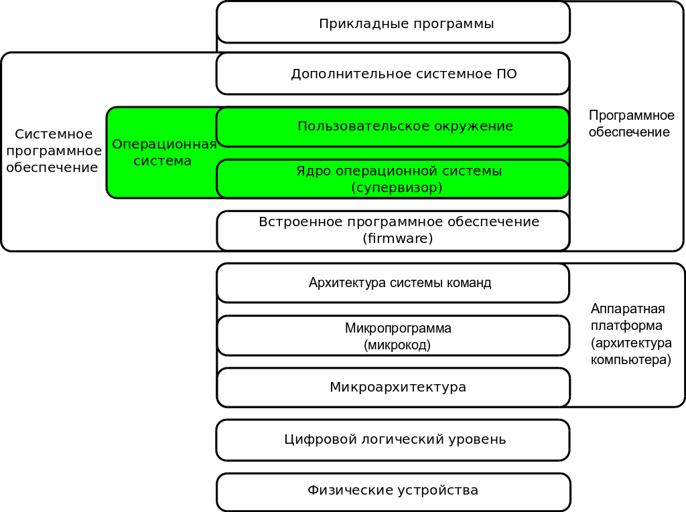
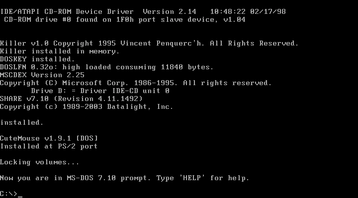
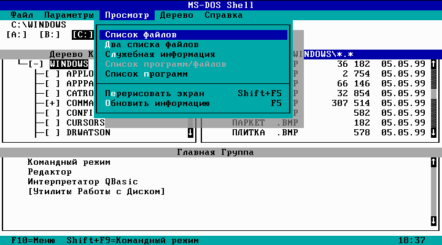
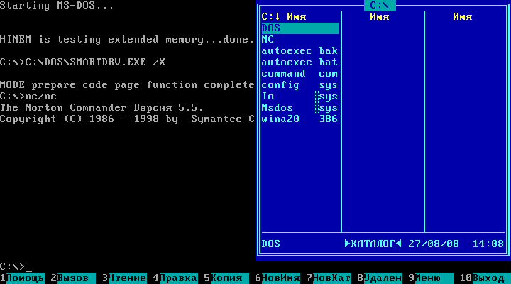
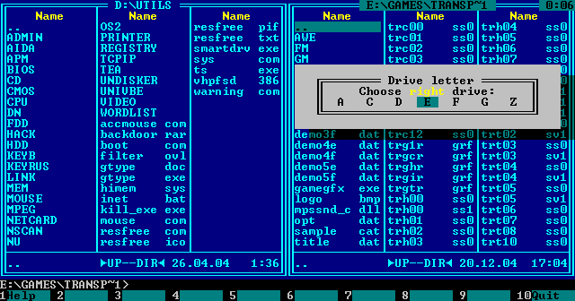
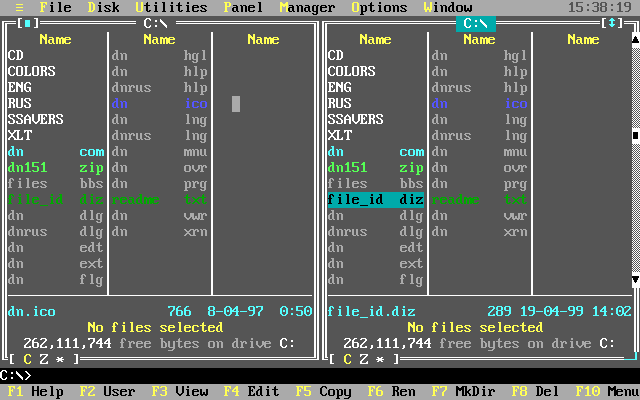
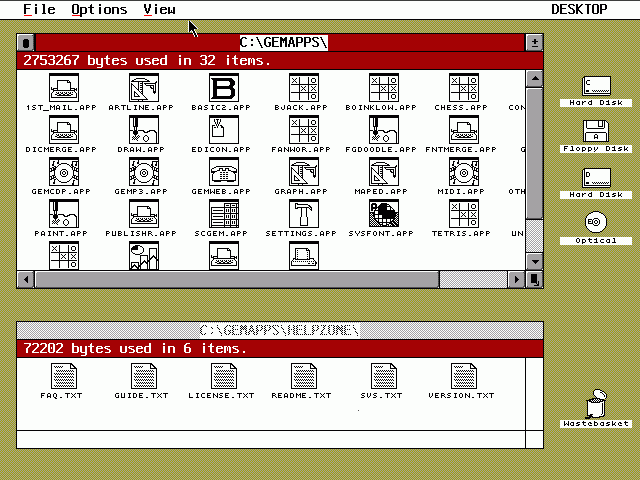
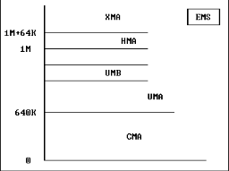

# Операционные системы

### Литература

- Э. Таненбаум Современные операционные системы.
- Олифер В.Г., Олифер Н.А. Сетевые операционные системы
- Робачевский А.М. Операционная система Unix.
- [Линус Торвальдс, Дэвид Даймонд. Just for fun](http://www.lib.ru/LINUXGUIDE/torvalds_jast_for_fun.txt_with-big-pictures.html)

### Оглавление

- [Операционная система](#Лекция-1)
- [MS-DOS](#Лекция-2)
- [MS Windows](#MS-Windows)

## Лекция 1

Операционная система - ОС (англ. operating system, OS) -- комплекс взаимосвязанных программ, предназначенных для:

- управления ресурсами компьютера
- организации взаимодействия с пользователем

### ОС - назначение

основные аспекты

- управление устройствами,
- управление вычислительными процессами,
- распределение вычислительных ресурсов между вычислительными процессами
- организация надёжных вычислений.

### Логическая структура ОС

операционная система в многоуровневой структуре компьютера

### Функции ОС

Основные функции

- Исполнение запросов программ
- Загрузка программ в оперативную память и их выполнение
- Стандартизованный доступ к периферийным устройствам
- Управление оперативной памятью
- Управление доступом к данным на различных носителях
- Обеспечение пользовательского интерфейса
- Сохранение информации об ошибках системы

Дополнительные функции

- Параллельное или псевдопараллельное выполнение задач (многозадачность)
- Эффективное распределение ресурсов вычислительной системы между процессами
- Разграничение доступа различных процессов к ресурсам
- Организация надёжных вычислений основанная на разграничении доступа к ресурсам
- Взаимодействие между процессами: обмен данными, взаимная синхронизация
- Защита самой системы, а также пользовательских данных и программ от действий пользователей или приложений
- Многопользовательский режим работы и разграничение прав доступа

### Современные универсальные ОС

Характеристики ОС

- использующие файловые системы (с универсальным механизмом доступа к данным),
- многопользовательские (с разделением полномочий),
- многозадачные (с разделением времени).

### Необходимость ОС

Условие 1

- вычислительная система используется для различных задач, причём программы, решающие эти задачи, нуждаются в сохранении данных и обмене ими

Следовательно

- необходим универсальный механизм сохранения данных = файловая система
- необходима возможность перенаправления вывода одной программы на ввод другой

Условие 2

- различные программы нуждаются в выполнении одних и тех же рутинных действий 

Следовательно 

- операционные системы предоставляют системные библиотеки часто используемых подпрограмм (функций)

Условие 3

- между программами и пользователями системы необходимо распределять полномочия

Следовательно

- пользователи должны иметь возможность защищать свои данные от несанкционированного доступа
- возможные ошибки в программе не должны вызывать тотальных неприятностей

Условие 4

- необходима возможность имитации "одновременного" исполнения нескольких программ на одном компьютере (даже содержащем лишь один процессор)

Следовательно

- специальный компонент, называемый планировщиком, делит процессорное время на короткие отрезки и предоставляет их поочерёдно различным исполняющимся программам (процессам)

Условие 5

- оператор должен иметь возможность управлять процессами выполнения отдельных программ

Следовательно

- необходимы операционные среды - оболочка и наборы утилит - они могут являться частью операционной системы

В некоторых приложениях операционные системы излишни

- встроенные микрокомпьютеры
- простые игровые приставки

Примеры

- бытовые приборы
- автомобили
- сотовые телефоны

### Состав операционной системы

Ядро

- планировщик
- драйверы устройств
- файловая система
- сетевая подсистема

Системные библиотеки

- Статические библиотеки (*.lib - Windows, *.a - Linux)
- Динамические библиотеки (*.dll - Windows, *.so - Linux)

Оболочка с утилитами

- Оболочка - интерпретатор команд ОС, обеспечивающий интерфейс для взаимодействия пользователя с функциями системы
- Утилита - вспомогательная компьютерная программа в составе общего программного обеспечения

### Режимы работы процессора

Непривилегированный ("пользовательский") режим

- Большинство программ, как системных так и прикладных, получают доступ к оборудованию (и, при необходимости, к другим ресурсам ядра, а также ресурсам иных программ) только посредством системных вызовов

Привилегированный режим

- Исполняется ядро

### Ядро операционной системы

Ядро - центральная часть операционной системы

- управляющая выполнением процессов
- ресурсами вычислительной системы
- предоставляющая процессам координированный доступ к этим ресурсам

Основные ресурсы

- процессорное время
- память
- устройства ввода-вывода

Дополнительные ресурсы

- доступ к файловой системе
- сетевое взаимодействие

### Объекты ядра ОС

Типы объектов - 1

- Процессы - совокупность взаимосвязанных и взаимодействующих действий, преобразующих входящие данные в исходящие
- Файлы - блок информации на внешнем запоминающем устройстве компьютера, имеющий определённое логическое представление, соответствующие ему операции чтения-записи и, как правило, фиксированное имя, позволяющее получить доступ к этому файлу и отличить его от других файлов
- События - объект, хранящий в себе 1 бит информации "просигнализирован или нет", над которым определены операции "просигнализировать", "сбросить в непросигнализированное состояние" и "ожидать"
- Потоки - объекты, позволяющие разделить процесс, порождённый в операционной системе, на несколько частей, выполняющихся "параллельно", то есть без предписанного порядка во времени.

Типы объектов - 2

- Семафоры - объект, позволяющий войти в заданный участок кода не более чем n потокам
- Мьютексы - (взаимоисключения) - это объект синхронизации, который устанавливается в особое сигнальное состояние, когда не занят каким-либо потоком
- Каналы - средства для осуществления взаимодействия между процессами
- Файлы, проецируемые в память - это такой способ работы с файлами, при котором файлу ставится в соответствие определённый участок памяти

### Эволюция ОС

Основные идеи

- Предшественники ОС
- Пакетный режим
- Разделение времени и многозадачность
- Разделение полномочий
- Реальный масштаб времени
- Файловые системы

### Предшественники ОС (конец 1940-х годов)

Загрузчики

- загрузка программ

Мониторы

- отслеживание выполнения программ

Библиотеки

- выполнение повторяющихся операций

### Пакетный режим (1950-е годы)

Условие

- наличие очереди программ на исполнение

Обеспечение

- загрузки программы с внешних носителей данных в оперативную память до завершения предыдущей программы

### Разделение времени и многозадачность

Необходимость

- наличие очереди программ на исполнение
- наличие дисплея
- наличие клавиатурного ввода

Результат - многопользовательские системы

- один центральный процессор
- один блок оперативной памяти
- множество терминалов

Выполнение

- ввод данных - режим диалога
- вычисления - пакетный режим

### Разделение полномочий

Отсутствие

- изменения программы другой программой
- изменения самой системы прикладной программой

Архитектура процессора

- "реальный" режим работы процессора - (программе доступно всё адресное пространство компьютера)
- "защищённый" режим (программе доступен диапазон, выделенный при запуске программы на исполнение)

### Реальный масштаб времени

"Реальное время"

- синхронизации исполнения программ с внешними физическими процессами

Возможности системы

- обслуживание производственных процессов
- решение вычислительных задач

### Файловые системы

Причины возникновения - замена носителей

- с последовательным доступом (перфокарт)
- с произвольным доступом (на жестких дисках)

Определение

 - Файловая система - порядок, определяющий способ организации, хранения и именования данных на носителях информации в компьютерах

Определяет

- формат содержимого
- способ физического хранения информации
- размер имени файла
- максимальный возможный размер файла
- набор атрибутов файла

### Классификация компьютеров

Виды классификации

- по назначению
- по уровню специализации
- по размеру
- по совместимости

### Классификация производителей компьютеров

Виды

- Персональные компьютеры
  + настольные - Windows, Linux, Mac OS
  + переносные - Windows, Mac OS, Linux
  + наладонные - Linux, Mac OS, Windows
- Серверы - малые - Windows, Linux, Mac OS
- Серверы - большие - Linux, Mac OS, Windows
- Мэйнфреймы - UNIX, Linux
- Суперкомпьютеры - Linux, UNIX

## Лекция 2

DOS - Дисковая операционная система

Особенности:

- однозадачная операционная система
- 8 / 16 / 32 - битная операционная система
- работает в реальном режиме
- используются функции, предоставляемые ОС
- исплоьзуются функции, предоставляемые BIOS
- работает с утройствами напрямую
- имеет консольную систему ввода/вывода
- поддерживает три стандартных потока: stdin, stdout и stderr

## Основные варианты DOS

Характеристики

|Name|Firm|Year|Proc|Bit|Lic|SRC|
|---|---|---|---|---|---|---|
|MSDOS|Microsoft|1981|x386|16|CL|CS|
|PCDOS|IBM|1981|x386|16|CL|CS|
|DR DOS|Digital Res.|1983|x386|16|CL|CS|
|OpenDOS|Caldera|1997|x386|16/32|OL|OS|
|FreeDOS|GNU|1994|x386|16/32|GP|OS|
|PTS-DOS|Физтех-софт|1991|x386|32|CL|CS|
|ROM-DOS|Datalight|1989|x386|16|CL|CS|
|AppleDOS|Apple Computer|1978|MP6502|16|CL|CS|
|Atari DOS|Atari|1985|Atari400|8/16|CL|CS|
|TR-DOS|Technology Res.|1984|ZX|8|CL|CS|

### Основные части DOS

Состав

- BIOS
- Загрузчик ОС
- Системные файлы - IO.SYS, MSDOS.SYS
- Командный процессор - command.com
- Внутрениие команды DOS
- Внешние команды DOS
- Драйвера устройств

### BIOS (Basic Input/Output System)

Находится в ПЗУ

- рассматривается как часть аппаратных средств ПК
- рассматривается как часть программног ообеспечания, входящую в состав ОС

Назначение

- Универальные услуги ввода-вывода
- Тестирование функционирования компьютера
- Проверка работы памяти и устройств компьютера при его включении
- Вызов загрузчика операционной системы

### Загрузчик ОС

Назначение

 - системное ПО, обеспечивающее загрузку ОС непосредственно после включения компьютера
 
Основные функции 

- обеспечивает средства для диалога с пользователем
- проводит инициализацию аппаратуры компьютера
- загружает ядро ОС в ОЗУ
- формирует параметры, передавемые ядру ОС
- передает управление ядру ОС

### IO.SYS - системный файл

Содержит

- драйверы устройств
- код первичной настройки DOS

Выполняет

- Инициализацию драйверов для консоли, диска, последовательного порта и т.д.
- Загружает ядро DOS из MSDOS.SYS
- Обрабабтывает файл CONFIG.SYS
- Загружает оболочку COMMAND.COM

### MSDOS.SYS - системный файл

Содержит

- часть кода ядра ОС, реализующую интерфейсы к системе

### Загрузка DOS

Этапы

- Питание - Power
- Проверка оборудования - POST  
- Программа начальный загрузки (BIOS)
- Загрузчик (HDD, FDD, CDROM)
- Дисковые файлы - IO.SYS, MSDOS.SYS
- Файл command.com
- Файл config.sys
- Файл autoexec.bat

### config.sys

состав

- Break = ON
- Files = 32
- Buffers = 16
- Device = C:\MOUSE\mouse.sys
- Device = C:\RUS\keyrus.sys

### autoexec.bat

состав

- @echo off
- PATH C:\DOS;C:\NC;C:\AVIRUS
- SET TMP = C:\TMP
- C:\NC\nc.exe

### Основные внутренние команды DOS

Выполняет командный процессор command.com

- b: - переход на дисковод b:
- dir - вывода оглавления каталога
- cd имя каталога - смена текущего каталога
- cd.. - переход из подкаталога в каталог
- md имя каталога - создание каталога
- rd имя каталога - удаление пустого каталога
- type имя файла - вывод содержимого текстового файла на экран
- cls - очистка экрана монитора
- copy имя файла1 имя файла2 - копирование одного файла в другой файл
- ren имя файла новое имя файла - переименование файла
- del имя файла - удаление файла
- Создание текстового файла: copy con: имя файла, Enter, ввести построчно текст, в конце каждой строки Enter, затем в конце Ctrl+Z и Enter.
- ver - вывод версии DOS
- date - ввод текущей даты
- time - ввод текущего времени

### Основные внешние команды DOS

Внешние команды DOS выполняют вспомогательные программы (утилиты), расположенные в каталоге DOS на диске С:

- format имя диска: - форматирование диска (для дискет format a:)
- fdisk - разбиение жесткого диска на разделы
- sys имя диска: - создание системного диска (перенос файлов ядра DOS на диск)
- mem - вывод карты оперативной памяти
- chkdsk c: /f - проверка файловой системы и восстановление потерянных кластеров
- scandisk - проверка файловой системы и диска на наличие логических сбоев
- label имя диска: - создание или обновление метки на диске
- undelete имя диска: - восстановление случайно стертых файлов
- diskcopy имя диска: имя диска: - создание точной копии дискеты
- defrag c: /fd - устранение фрагментации файлов
- msd - диагностика компьютера
- edit - вызов текстового редактора MS-DOS Editor
- qbasic - вызов языка программирования BASIC
- memmaker - оптимизатор распределения оперативной памяти

### MS DOS

DOS command.com

### DOS shell

текстовый (псевдо-графический) интерфейс пользователя

Оболочка для MSDOS

### Norton commander

файловый менеджер

ОС = DOS, Автор=Джон Соухэ (Peter Norton Computing/Symantec)

### Volkov commander

компактный файловый менеджер

ОС = DOS, Автор = Всеволод Волков, Shareware

### DOS Navigator

расширенный файловый менеджер

ОС = OS/2 и DOS, Разработчик = Ritlabs, Open Source

### Графический файловый менеджер для FreeDOS

OpenGEM

ОС = FreeDOS, Разработчик = Digital Research, FreeDOS, GNU GPL

### Файловые менеджеры для различных ОС

- Far manager (ОС = Wndows)
- Midnight Commander (ОС = Linux,Windows, OS/2,MacOSX)
- MuCommander (ОС = MacOSX,Windows, Linux,Solaris, FreeBSD,OpenVMS)

### CLI и GUI

Сравнение:

|N|Характеристики|CLI|GUI|
|---|---|---|---|
|1|Использование|Просто (опытные)|Просто (новички)|
|2|Управление|Сложные задачи|Простые задачи|
|3|Многозадачность|Одно окно|Много окон|
|4|Интерфейс|Простой|Много разных|
|5|Скорость|Быстро|Медленно|
|6|Ресурсы|Мало|Много|
|7|Скрипты|Легко|Сложно|
|8|Удаленный доступ|Возможен всегда|Не всегда|
|9|Возможности|Не ограничены|Ограничены|
|10|Нагрузка|Клавиатура|KBD+Mouse|

### Проблема 1 MB (640 Kb) в MSDOS

Память MSDOS

Распределение

- CMA - основная оперативная память (Conventional Memory Area)
- UMA - верхняя память (Upper Memory Area)
- UMB - блоки верхней памяти (Upper Memory Block)
- HMA - высокая память (High Memory Area)
- XMA - расширенная память (Extended Memory Area)
- EMS - дополнительная память (Expanded Memory)

## MS Windows

Особенности:

- многозадачная операционная система
- 32/64 - битная операционная система
- работает в защищенным режиме
- стандартизация интерфейсов аппаратного обеспечения
- единообразие для пользовательских интерфейсов программ

### Возможности системы Windows

Операционная система Windows:

- поддерживает вытесняющую многозадачность
- работает на разных аппаратных архитектурах
- поддерживает работу с виртуальной памятью
- является полностью рентабельной
- хорошо масштабируется
- является распределенной вычислительной платформой
- защищена как от внутренних сбоев, так и от внешних
- деструктивных действий
- совместима по ее пользовательскому интерфейсу и API
- обладает высокой производительностью
- обеспечивает простоту адаптации
- поддерживает многопоточность и объектную модель

### Преимущества и недостатки Windows

Преимущества

- Единый пользовательский интерфейс
- Удобство и поддержка устройств
- Поддержка масштабируемых шрифтов
- Поддержка мультимедиа
- Многозадачность
- Средства обмена данными
- Совместимость с DOS-программами
- Защита от вирусов
- доступность всей оперативной памяти
- динамическое подключение библиотек

Недостатки

- Сложный программный интерфейс
- Необходимость поддержки устройств
- Проблемы с многозадачностью
- Несовместимость с DOS-программами
- Множество вирусов
- Ад dll
- увеличения нагрузки на аппаратные средства
- Слабая поддержка многих пользователей
- необходимость дефрагментации
- деградация системы со временем
