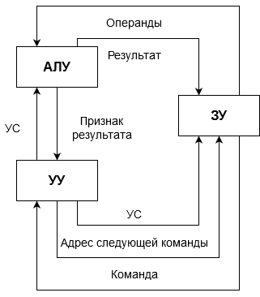
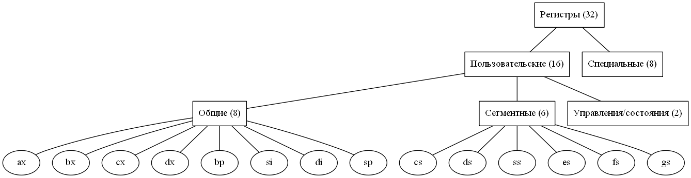
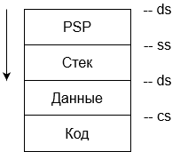

# Вычислительные машины, системы и сети

## Архитектура вычислительных машин

### Информация и способы ее измерения

Информация - это данные, меняющиеся во времени

### Элементарные арифметические операции в 2-ой и 16-ой системах счисления

В 2-ом числе младший разряд указывает на четность числа:

- 0 - четные
- 1 - нечетные

Признаки "отрицательного" числа в 2-ой системе:

1. старший разряд "1"
2. Базовый размер регистра - 16 бит (2 байта)

Регистры:

- полные (2 байта)
- полурегистры (1 байт)

### Структурные схемы вычислительной машины

Вычислительная машины- устройство по приему, обработке, хранению и выводу информации.

Виды информации (субъективной):

1. визуальная (статическая, динамическая)
2. звуковая
3. тактильная
4. вкусовая
5. запах

### Структурная схема персонального компьютера

### Принципы фон Неймана:

1. Любой алгоритм представляется в виде некоторой последовательности команд (слов). Каждая отдельная команда определяет простой единичный шаг преобразования информации
2. Принцип условного перехода. В процессе вычислений в зависимости от полученных произвольных результатов возможен переход на некоторой участок команды.
3. Принцип хранимой программы. Команды вычислительной машины представляются в такой же кодируемой форме, что и другие данные, и хранятся в таком же оперативном запоминающем устройстве, т.е. если рассматривать содержимое, то без	какого-либо специального средства невозможно отличить где данные, а где команды => любые команды можно обрабатывать как данные
4. Принцип двоичного кодирования. Все данные и команды кодируются в двоичном виде.
5. Принцип иерархии запоминающих устройств. Ячейки памяти ЭВМ имеют адреса, которые последовательно пронумерованы.

Самое главное следствие этих принципов - программ перестает быть постоянной и неизменяемой частью машины.

Структурная схема ЭВМ

<table>
    <tr>
        <td rowspan="2"><b>Устройства ввода</b> веб-камера сканер микрофон клавиатура</td>
        <td><b>Устройства связи</b> витая пара модем сетевая карта wi-fi bluetooth ик-порт</td>
        <td rowspan="4"><b>Устройства вывода</b> клавиатура монитор видео и аудио принтер очки плоттер</td>
    </tr>
    <tr>
        <td rowspan="2"><b>Устройства обработки</b> CPU(ЦПУ) RAM(ОЗУ) ROM(ПЗУ) Cache(кэш)</td>
    </tr>
    <tr>
        <td rowspan="2"><b>Устройства управления</b> мышь тачпад трекбол трекпоинт джойстик клавиатура</td>
    </tr>
    <tr>
        <td><b>Устройства хранения</b> перфокарта/перфолента жесткий диск лазерный диск дискета магнитная лента</td>
    </tr>
</table>

Частота шины - некая предельно допустимая частота передачи данных по шине при которой гарантированно не искажается информация.

### Структурная схема процессора

1. АЛУ (Арифметико-логическое устройство) - арифметические и логические операции
2. УУ (Устройство управления) - управляет АЛУ, ЗУ и связывается с периферийными устройствами
3. ЗУ (запоминающие устройство) - регистровая память для временного хранения информации о данных, адресах и т.д.

### Схема связи в ЦПУ

УУ обращается в ЗУ за адресом очередной команды. Получив из ОЗУ команду ЗУ передает команду (в виде операндов) на АЛУ, а действенную часть команды на УУ. АЛУ по устройству связи (УС) осуществляет операции. Результат -> в ЗУ, а признак результата идет в УУ, которое формирует адрес следующей команды.

### Регистры и их классификация

Регистр - элемент внутренней памяти небольшого размера. Его размер - 16 бит (2 байта). Всего регистров в минимальной комплектации 32 штуки.

### Общие регистры

В общие регистры можно записать любую информацию.

- ax - подготавливает номер команды
- bx - хранение параметров
- cx - организует циклы
- dx - хранение параметров
- bp - специально назначение
- si - специально назначение
- di - специально назначение
- sp - специально назначение

### Сегментные регистры

Сегментные регистры - используются для хранения части сегмента.

Программа из .exe/.com с внешнего носителя загружается в ОЗУ в момент ее запуска. В ОЗУ выделяются сегменты. Стековая память позволяет без длительной процедуры адресации осуществлять чтение и запись данных в определённой последовательности. Причём последовательность чтения данных прямо
противоположно последовательности их записи.

для exe выделяется 3 вида сегментов 

- сегмент кода (для кода)
- сегмент данных (для констант и переменных)
- сегмент стека (стековая память позволяет осуществлять чтение данных в определенной последовательности, причём последовательность чтения данных прямо противоположно их записи)

В начале выполнение exe программы в регистре ds хранится базовая часть адреса PSP. PSP (Program Segment Prefix) - префикс программного сегмента, Область позволяющая инициализировать стартовую часть программы. Размер префикса 256 Байт. Сегментные регистры используются для хранение адреса базисной части сегментов кода (PSP).

Флаговый регистр содержит информацию о результате выполненных команд. Флаги - отдельные взятые биты (boolean).

### Структура регистра

<table>
    <tr>
        <td></td>
        <td></td>
        <td>15</td>
        <td>14</td>
        <td>13</td>
        <td>12</td>
        <td>11</td>
        <td>10</td>
        <td>9</td>
        <td>8</td>
        <td>7</td>
        <td>6</td>
        <td>5</td>
        <td>4</td>
        <td>3</td>
        <td>2</td>
        <td>1</td>
        <td>0</td>
    </tr>
    <tr>
        <td></td>
        <td></td>
        <td colspan="8">AHigh</td>
        <td colspan="8">ALow</td>
    </tr>
    <tr>
        <td></td>
        <td></td>
        <td colspan="16">AX 16 </td>
    </tr>
    <tr>
        <td></td>
        <td colspan="17">EAX 32 </td>
    </tr>
    <tr>
        <td colspan="18">RAX 64 </td>
    </tr>
</table>

### Уникальный регистр

IP - регистр счетчик с адресом команды

### Адресация в памяти

#### Понятие о смещении

Полный адрес сегмента:

- базовая часть - 16 бит

Размер каждого регистра составляет 16 бит.

Для того чтобы увеличить адресное пространство вводится 4 символа в адрес. Таким образом адрес начала каждого сегмента состоит из 20 бит: старшие 16 бит записаны в соответствующие сегменты регистры, а оставшиеся 4 бита равны 0. Таким образом оперативная память с точки зрения сегментации поделена на области с максимальным шагом в 64 кбайта. Для того чтобы обратиться к ячейкам памяти внутри любого сегмента необходимо иметь также двадцати разрядный адрес. Такой адрес формируется путём сложения адреса начала сегмента и адреса внутри сегмента.

Смещение - это адрес внутри сегмента.

Смещение в какой то момент может быть записано в каком-то регистре. Поскольку регистр 16 битный, то адресное пространство внутри сегмента задаваемое смещение не может превышать 64 кбайта.

## Структура программы

В начале любой программы в памяти размещается префикс программы PSP занимающей 256 байт.

Префикс или PSP это структура данных для операционной системы которая хранит состояние и некоторые параметры программы, в частности там содержится информация:

- о размере доступной памяти
- о параметрах командной строки 
- адреса обработчиков прерываний при нажатии некоторых клавиш и комбинаций

Адрес запускающий программу 

Файлы с расширением EXE это файлы, которые образуют несколько сегментов.

COM программа состоит из одного сегмента (внутри размещается код, данные и стек)

### Структура программы на языке ассемблера

Программа (исходный код) на языке ассемблера можно писать в любом текстовом редакторе, сохраняется  в файле ASM.
